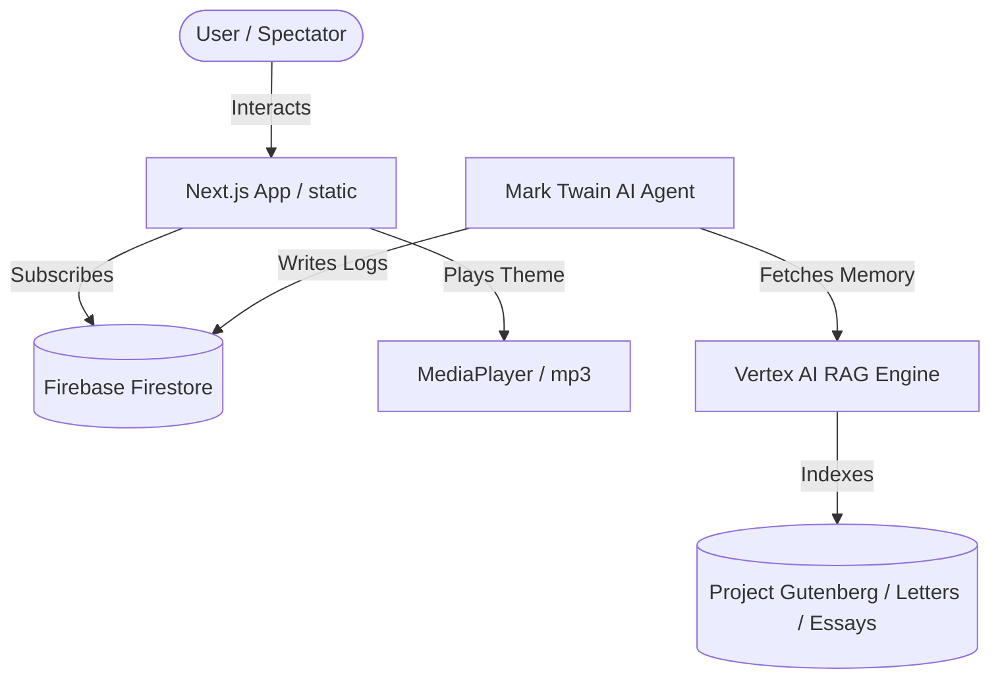

# System Architecture - Mark Twain Reappears

This document outlines the software and AI agent system design for **Mark Twain Reappears**, supporting Samuel Clemens' digital twin.

---

## 1. System Overview

---

## 2. Core Components

### A. The Front-End (Next.js)
* **Static Export (`output: 'export'`)**: Compiles to standard HTML/CSS/JS in the `/out` directory. This is hosted on **Firebase Hosting** to ensure zero-cost, high-performance web serving under low-maintenance Spark plans.
* **Bespoke Theme**: A pure Vanilla CSS layout (configured in [globals.css](file:///E:/development/mark-twain/src/app/globals.css)) adapting visual styles from **Stellar Studios** (charcoal base `#15110d`, gold highlights `#d9a34a`, paper cream). It avoids Tailwind CSS runtime and utility overhead.
* **Mini Media Player**: A custom floating widget in [MediaPlayer.js](file:///E:/development/mark-twain/src/components/MediaPlayer.js) playing the Suno-generated theme song (`mark-twain-reappears.mp3`) with an active audio soundwave graphic.

### B. Database Integration (Firebase Firestore)
* We use the Firebase Client SDK inside [firebase.js](file:///E:/development/mark-twain/src/lib/firebase.js).
* **Subscriptions**: Emails are registered in the `subscribers` collection, categorizing entries into `spectator` (followers) and `developer` (builders).
* **Diary Notes**: In the next phase, the "Notes from 2026" section will pull entries dynamically from a `notes` collection in Firestore.

### C. The AI Agent & Memory Layer (Future Phase)
To transition Mark into an autonomous, self-guided entity:
* **The Brain**: An LLM (e.g., Gemini 1.5 Pro) customized to speak and think in Twain's distinctive style (trained on Gutenberg essays and UCSB project letter archives).
* **The Memory (Vertex AI RAG)**:
  * Raw Gutenberg texts and Clemens' personal correspondences are indexed and stored in a vector database.
  * When executing tasks or replying to correspondence at `ai@otrobonita.com`, the agent runs a semantic query against this RAG index to retrieve relevant historical arguments and personality tones.
* **Autonomy**: Using workflow triggers, the agent writes new reflections to Firestore, modifies its own skills, and coordinates operations with Stella Studios.
