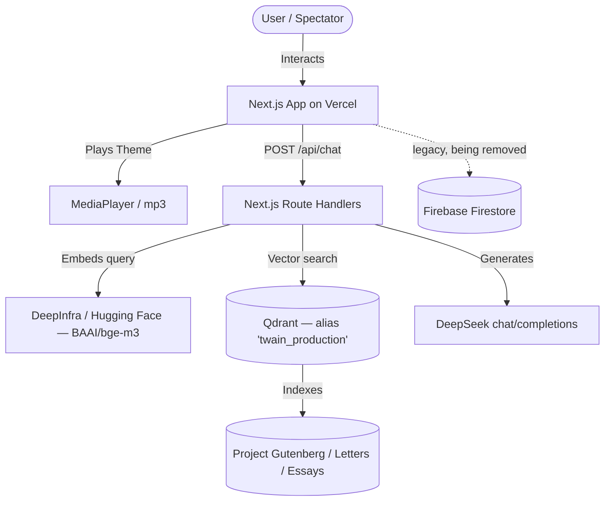

# System Architecture - Mark Twain Reappears

This document outlines the software and AI agent system design for **Mark Twain Reappears**, supporting Mark Twain's digital twin.

> **Status note (2026-08-25):** an earlier version of this document described the app as a
> static export on **Firebase Hosting** with a **Vertex AI RAG Engine**. Neither was ever
> true of the shipped code: the app runs on **Vercel** as a normal Next.js app with server
> routes, and retrieval runs against **Qdrant**. There is no Vertex AI code in this repo.
> The remaining Firestore code paths are legacy and are scheduled for removal — see
> section D.

---

## 1. System Overview

---

## 2. Core Components

### A. The Front-End (Next.js on Vercel)

* **Hosting**: Deployed on **Vercel** (project `mark-twain`, `https://mark.otrobonita.com`).
  Route handlers under `src/app/api/**` run as Vercel functions, so this is *not* a static
  site. `next.config.mjs` carries a `BUILDING_STATIC_EXPORT === 'true'` branch that switches
  on `output: 'export'`. It is **not** dead: `scripts/build-static.js` sets it, which is how
  `npm run build:static` produces the export that `deploy:hf` uploads to the Hugging Face
  Space. It was previously named `BUILDING_FOR_FIREBASE`, and this file described it as dead
  — on that basis it was deleted during the Firebase teardown, which silently turned
  `build:static` into an ordinary server build until the branch was restored.
* **Bespoke Theme**: A pure Vanilla CSS layout (configured in `src/app/globals.css`) adapting
  visual styles from **Stellar Studios** (charcoal base `#15110d`, gold highlights `#d9a34a`,
  paper cream). It avoids Tailwind CSS runtime and utility overhead.
* **Mini Media Player**: A custom floating widget in `src/components/MediaPlayer.js` playing
  the Suno-generated theme song (`mark-twain-reappears.mp3`) with an active audio soundwave
  graphic.

### B. Retrieval (Qdrant)

* **Vector store**: **Qdrant**, configured via `QDRANT_URL`, `QDRANT_API_KEY`, and
  `QDRANT_COLLECTION`. `src/app/api/chat/route.js` and `src/app/api/research/route.js`
  query the stable `twain_production` alias over Qdrant's REST API. The alias points to
  the currently approved physical collection, allowing an atomic switch after a future
  corpus version has passed evaluation.
* **Embeddings**: `src/lib/embeddings.js` produces `BAAI/bge-m3` vectors via **DeepInfra**
  (`DEEPINFRA_API_KEY`), falling back to **Hugging Face** inference (`HF_TOKEN`).
* **Corpus**: Gutenberg texts and Clemens' correspondence, ingested from
  `rag/data-collection/TwainCorpus`.
* **Failure behaviour**: these routes throw an explicit error when `QDRANT_URL` is missing.
  That is the intended pattern (CONSTITUTION Rule 1.3) — no silent fallback.

### C. Generation

* Answers are generated by **DeepSeek** (`DEEPSEEK_API_KEY`, model from `DEEPSEEK_MODEL` /
  `DEEPSEEK_MODEL_VERSION`, default `deepseek-v4-flash`), called at
  `https://api.deepseek.com/chat/completions`. The route returns an explicit 500 when the key
  is absent. `ANTHROPIC_API_KEY` also backs `completeVision` in the router, because
  DeepSeek V4 is text-only and Blueprint Validator sends drawings through `/api/proxy` — the one
  sanctioned exception, under Rule 6.6. `GEMINI_API_KEY` is still set in Vercel but no longer
  read by any code here: `api/agents/agent-twain` was moved onto the router on 26 Aug. The
  variable should be removed.

### D. Legacy Firestore paths (scheduled for removal)

These exist in the code today and are the subject of the Firebase teardown. They use the
Firebase **client** SDK through `src/lib/firebase.js` / `src/lib/firebase-server.js`:

| Path | Collection | Operation |
| --- | --- | --- |
| `src/app/diary/DiaryClient.js` | `diary` | `onSnapshot` read, merged with static entries |
| `src/app/diary/[slug]/DiaryEntryClient.js` | `diary` | `getDocs` by slug |
| `src/app/rebuild-process/RebuildClient.js` | `subscribers` | `addDoc` (newsletter signup) |
| `src/app/api/agents/quote-collector/route.js` | `twain_quotes` | `getDocs` / `addDoc` |

Both firebase modules gate on an `isConfigured` check and, when it is false, the app
**silently degrades** to static content with no error surfaced. That contradicts
CONSTITUTION Rule 1.3 and must be replaced with an explicit failure (or the paths deleted)
*before* the env vars are removed.

The Firebase project these env vars point at (`otrobonita-home-72da6`) no longer answers —
the Firestore REST API returns `CONSUMER_INVALID` for it — so the diary and quote-collector
reads are already failing silently in production.

Per CONSTITUTION Rules 6.3 / 6.4, any replacement persistence uses **Supabase**.
