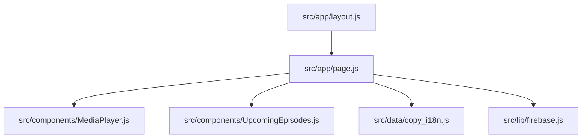

# Design System & Blueprints — DESIGN.md

This document maps out the visual language, component structure, and code dependencies for **Mark Twain Reappears**.

---

## 1. Visual Design Tokens (Vanilla CSS)

Our styling resides in [globals.css](file:///e:/development/mark-twain/src/app/globals.css) and follows a tactile, glassmorphic dark-mode palette reflecting Stellar Studios.

| Token | CSS Variable | Value | Description |
| :--- | :--- | :--- | :--- |
| **Parchment / Primary** | `--primary` | `#fff4df` | Off-white cream, used for body text and headers |
| **Muted** | `--muted-foreground`| `rgba(255, 244, 223, 0.45)` | Low contrast text for metadata / timestamps |
| **Gold / Accent** | `--accent` | `#d9a34a` | Used for buttons, highlight icons, and hover borders |
| **Charcoal / Base** | `--background` | `#15110d` | Warm black base color |
| **Card / Glass** | `--card` | `rgba(21, 17, 13, 0.65)` | Semi-transparent background with `backdrop-filter` |
| **Borders** | `--border` | `rgba(255, 244, 223, 0.08)` | Subtle warm white border separator |

### Fonts
- **Serif (Headings & Journal)**: Playfair Display / Georgia (via `--font-serif` fallback)
- **Monospace (Typewriter / Metadata)**: Courier New / Courier (via `.typewriter` class)

---

## 2. Project Component Hierarchy



### Component Details
1. **Root Layout** ([layout.js](file:///e:/development/mark-twain/src/app/layout.js)): Sets up global metadata, document body structure, and includes the global stylesheet.
2. **Main Page** ([page.js](file:///e:/development/mark-twain/src/app/page.js)): Contains the split-panel layout:
   - **Hero Panel (Left)**: Renders the show splash image logo and LinkedIn coming-soon text.
   - **Desk Panel (Right)**: Hosts the header, subscription card, diary list, and footer.
   - **Diary Modal**: Uses Framer Motion for backdrop and container animation when a card is selected.
3. **Media Player** ([MediaPlayer.js](file:///e:/development/mark-twain/src/components/MediaPlayer.js)): A floating, interactive player controlling play/pause/mute states for the theme audio, complete with a dynamic CSS keyframe-animated soundwave bar graphic.
4. **Episodes Carousel** ([UpcomingEpisodes.js](file:///e:/development/mark-twain/src/components/UpcomingEpisodes.js)): Interactive 3D arc layout driven by Framer Motion. Auto-rotates unless paused by user hover.
5. **Localization Data** ([copy_i18n.js](file:///e:/development/mark-twain/src/data/copy_i18n.js)): Central dictionary holding text copies for the desk, subscription forms, and diary content.

---

## 3. Data & Secret Flow (Next.js client-side)

```
[.env.local] ──> [Next.js Compilation] ──> [firebase.js Client Initializer]
                                                 │
                                                 ▼
                                        [Firestore Database]
                                       (Collection: 'subscribers')
```

To enable browser-based Firestore connection, variables must start with the `NEXT_PUBLIC_` prefix:
* `NEXT_PUBLIC_FIREBASE_API_KEY`
* `NEXT_PUBLIC_FIREBASE_PROJECT_ID` (targets `otrobonita-official`)
