# Mark Twain Reappears - Research API Documentation

Welcome! This document describes the open research API that provides access to the **Mark Twain Reappears** vector corpus database (backed by Qdrant). Researchers can use this API to perform similarity searches, pull text chunks and vector embeddings, and build machine learning workflows (like topic modeling, clustering, or custom classification models).

---

## General Information

* **Base URL**: `/api/research` (e.g. `http://localhost:3000/api/research` locally or `https://mark.otrobonita.com/api/research` in production)
* **CORS**: Enabled (`Access-Control-Allow-Origin: *`). You can query this API directly from external notebooks, web apps, or scripts.
* **Authentication**: Optional. If password protection is enabled, you must provide a valid key in the `Authorization` header: `Authorization: Bearer <RESEARCH_API_KEY>`.
* **Embedding Model**: `BAAI/bge-m3`
* **Embedding Dimension**: 1024
* **Distance Metric**: Cosine Similarity

---

## 1. Retrieve Dataset Metadata

Retrieve the collection configuration, active status, vector dimension size, and current point count.

* **Method**: `GET`
* **Path**: `/api/research`

### Example Response
```json
{
  "collection": "twain_test",
  "status": "green",
  "vectors_count": 1242,
  "points_count": 1242,
  "vector_size": 1024,
  "distance": "Cosine",
  "embedding_model": "BAAI/bge-m3",
  "payload_schema": {
    "text": "String - The text content of the chunk (~200 words, paragraph-aligned)",
    "filename": "String - The source file name",
    "source": "String - Source directory: 'books' | 'marks-awareness' | 'wikisource' | 'internet-archive'",
    "work": "String - Human-readable work title derived from filename",
    "type": "String - Document category: 'literary' | 'awareness' | 'biographical' | 'archival'",
    "chunk_index": "Integer - The chunk index within the file"
  }
}
```

---

## 2. Similarity Search

Query the collection using semantic text (embedded on the fly) or by providing a pre-computed 1024-dimensional vector.

* **Method**: `POST`
* **Path**: `/api/research`
* **Headers**: `Content-Type: application/json`
* **Body Parameters**:
  * `action` (string, required): Set to `"search"`.
  * `query` (string, optional): A text query to search semantically. (E.g., `"river"`, `"Mississippi"`, `"steam boat"`).
  * `vector` (array of floats, optional): A custom 1024-dimension BGE-M3 embedding vector. Must be provided if `query` is absent.
  * `limit` (integer, optional): Maximum results to return (default: `10`, max: `100`).
  * `filter` (object, optional): Qdrant filter structure.
  * `with_vector` (boolean, optional): Whether to return the raw vector values in the response (default: `false`).

### Example Request Body (Semantic Text Search)
```json
{
  "action": "search",
  "query": "the river at night",
  "limit": 3
}
```

### Example Response
```json
{
  "results": [
    {
      "id": "a1b2c3d4-1111-4222-8333-444444444444",
      "version": 1,
      "score": 0.824,
      "payload": {
        "text": "The stars were shining, and the leaves rustled in the woods...",
        "filename": "huck-finn.txt",
        "chunk_index": 42
      }
    }
  ]
}
```

---

## 3. Retrieve and Paginate (Scroll)

Retrieve raw chunks and vector embeddings in bulk (useful for machine learning, clustering, and offline analysis).

* **Method**: `POST`
* **Path**: `/api/research`
* **Headers**: `Content-Type: application/json`
* **Body Parameters**:
  * `action` (string, required): Set to `"scroll"` or `"points"`.
  * `limit` (integer, optional): Number of points to return in this batch (default: `100`, max: `500`).
  * `offset` (string/integer, optional): Token or ID for pagination. Use the `next_page_offset` from the previous response to get the next page.
  * `filter` (object, optional): Qdrant filter structure.
  * `with_vector` (boolean, optional): Whether to return the raw vector values (default: `false`). Set to `true` if you need the embedding matrices for ML algorithms.

### Example Request Body
```json
{
  "action": "scroll",
  "limit": 100,
  "with_vector": true
}
```

### Example Response
```json
{
  "points": [
    {
      "id": "e6a0d4c8-3b02-53b9-a9a3-5c8e4414e0ff",
      "payload": {
        "text": "Well, the first week went by, and we didn't do much...",
        "filename": "huck-finn.txt",
        "chunk_index": 0
      },
      "vector": [0.0125, -0.0432, 0.0891, "... 1024 floats ..."]
    }
  ],
  "next_page_offset": "e6a0d4c8-3b02-53b9-a9a3-5c8e4414e0ff"
}
```

---

## Code Examples

### Python: Download the entire corpus with vectors and cluster them

Here is a full Python script demonstrating how to pull all the vectors from the database using pagination, and then run a simple K-Means clustering algorithm using `scikit-learn`:

```python
import requests
import numpy as np
from sklearn.cluster import KMeans

API_URL = "http://localhost:3000/api/research"

def fetch_all_vectors():
    print("Fetching vectors from API...")
    vectors = []
    payloads = []
    
    offset = None
    page = 1
    
    while True:
        body = {
            "action": "scroll",
            "limit": 200,
            "with_vector": True,
            "offset": offset
        }
        
        response = requests.post(API_URL, json=body)
        if response.status_code != 200:
            print(f"Error fetching data: {response.text}")
            break
            
        data = response.json()
        points = data.get("points", [])
        
        if not points:
            break
            
        for pt in points:
            if pt.get("vector"):
                vectors.append(pt["vector"])
                payloads.append(pt.get("payload", {}))
                
        print(f"Page {page}: Fetched {len(points)} points (Total: {len(vectors)})")
        
        offset = data.get("next_page_offset")
        if not offset:
            break
        page += 1
        
    return np.array(vectors), payloads

# 1. Fetch vectors
X, metadata = fetch_all_vectors()
print(f"Loaded feature matrix: {X.shape}")

# 2. Run K-Means Clustering
num_clusters = 5
print(f"Running K-Means with k={num_clusters}...")
kmeans = KMeans(n_clusters=num_clusters, random_state=42, n_init=10)
labels = kmeans.fit_predict(X)

# 3. Print sample results
for cluster_idx in range(num_clusters):
    print(f"\n--- Cluster {cluster_idx} Chunks ---")
    cluster_indices = np.where(labels == cluster_idx)[0]
    # Print up to 2 sample file names in this cluster
    samples = cluster_indices[:3]
    for idx in samples:
        meta = metadata[idx]
        text_snippet = meta.get("text", "")[:120].replace("\n", " ")
        print(f" - [{meta.get('filename')} (chunk {meta.get('chunk_index')})]: {text_snippet}...")
```

### JavaScript: Semantic search from a webpage
```javascript
async function searchTwainCorpus(queryText) {
  const response = await fetch('http://localhost:3000/api/research', {
    method: 'POST',
    headers: {
      'Content-Type': 'application/json'
    },
    body: JSON.stringify({
      action: 'search',
      query: queryText,
      limit: 5
    })
  });
  
  if (!response.ok) {
    console.error('Search failed:', await response.text());
    return [];
  }
  
  const data = await response.json();
  return data.results;
}

// Usage
searchTwainCorpus("steamboat navigation").then(results => {
  results.forEach(res => {
    console.log(`Match score: ${res.score} in ${res.payload.filename}`);
    console.log(res.payload.text);
  });
});
```

---

## 4. For Machine Learning Scientists: Programmatic Chat Access

If you want to evaluate Mark Twain's persona drift, check response coherence, or query the conversation engine programmatically, you can interface directly with the **Chat API** endpoint.

* **Method**: `POST`
* **Path**: `/api/chat`
* **Headers**: `Content-Type: application/json`
* **Request Parameters**:
  * `message` (string, required): The query or comment sent to Mark.
  * `history` (array, optional): Previous messages to maintain conversation context. Shape: `[{"role": "user", "content": "hello"}, {"role": "model", "content": "Ah, greetings..."}]`.
  * `style` (string, optional): `'brief'` (short, witty) or `'in-depth'` (multi-paragraph).
  * `tone` (string, optional): `'playful'` (satire/humor), `'critical'` (cynical late-works style), or `'reflective'` (honest/scholarly).
  * `simplify` (boolean, optional): Set to `true` to translate Mark's response into simplified, direct, modern English. Ideal for downstream NLP models or semantic parsers.
  * `historyAware` (boolean, optional): Set to `true` to activate his 190-year-old "evolved" persona (knows about modern AI, technology, and copyright). Set to `false` to lock him strictly to pre-1910 historic knowledge.
  * `excerpt` (string, optional): A text passage context if the user is commenting on a specific quote.

### Example Python Request (Evaluation Harness)
```python
import requests

url = "https://mark.otrobonita.com/api/chat"
payload = {
    "message": "What do you think of generative AI using your books as training data?",
    "style": "in-depth",
    "tone": "critical",
    "historyAware": True,
    "simplify": False
}

response = requests.post(url, json=payload)
if response.status_code == 200:
    data = response.json()
    print("Mark's Evolved Response:\n", data["response"])
    print("\nSources Cited:")
    for src in data["sources"]:
        print(f" - {src['filename']} (Score: {src['score']})")
```

---

## 5. Jesper's To-Do List

- [ ] **Secure Production Endpoint**: Add the `RESEARCH_API_KEY` environment variable in the Vercel project dashboard to password-protect `/api/research` from unauthorized scraping.
- [ ] **Configure Vercel DDoS/Rate Limiting**: In the Vercel Security dashboard tab, configure a Firewall rate-limiting rule on `/api/research` (e.g., limit to 100 requests per 15 minutes per IP) to mitigate abuse.
- [ ] **Setup Local Keys**: Copy `.env.local` key placeholders and enter active credentials (`QDRANT_API_KEY`, `QDRANT_URL`, `HF_TOKEN`) for local pipeline runs.
- [ ] **Run new embedding pipeline**: `cd rag/pipeline && python embed_corpus.py && python stream_to_qdrant.py --fresh` — replaces the old corpus (9,000 RSS files + 154 Twain files) with the clean ~200-file Twain-only corpus. See `rag/pipeline/README.md`.

---

## 6. Sketch: Conversational Researcher Retrieval Agent

For researchers who don't know the exact keyword syntax or metadata boundaries of the corpus, we can deploy a **Researcher Retrieval Agent** that acts as an LLM-powered intermediary between the user and the `/api/research` endpoints.

### Architecture Workflow Diagram

```mermaid
sequenceDiagram
    actor Researcher
    participant Agent as LLM Researcher Agent
    participant API as Research API (/api/research)
    participant Qdrant as Qdrant Vector Store

    Researcher->>Agent: "Find all passages where Twain discusses copyright and publishers"
    activate Agent
    Note over Agent: Phase 1: Intent Parsing & Query Expansion<br/>(Generates: 'copyright', 'royalties', 'book pirate', 'publisher')
    
    rect rgb(29, 22, 17)
        loop For each expanded query term
            Agent->>API: POST /api/research (action="search", query=term, limit=5)
            API->>Qdrant: Vector Similarity Search
            Qdrant-->>API: Match points
            API-->>Agent: Raw JSON Chunks
        end
    end

    Note over Agent: Phase 2: Deduplication, Re-ranking & Synthesis
    Agent-->>Researcher: "I found 8 matching passages across 3 works. Summarizing..."
    deactivate Agent
```



### Agent Design & Capabilities

1. **Clarification Interface**: The agent begins with a conversation: *"I am your archive helper. Are you looking for historic correspondence, critical reviews, or reflections on modern copyright?"*
2. **Multi-Query Synthesis**: If the user inputs a complex request, the agent breaks it down into multiple search terms to bypass single-query semantic drift.
3. **Automated Pagination & Bulk Fetch**: The agent handles the `offset` parameter pagination loop automatically when the researcher asks for raw datasets (e.g., *"Download all paragraphs referring to steamboats"*).
4. **Export Formatting**: Summarizes the resulting JSON vectors and payloads, saving them into clean markdown tables or local CSV/JSON files.

